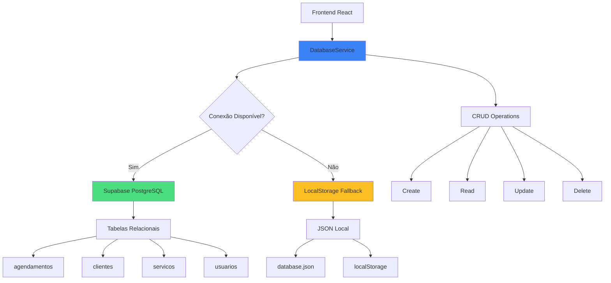
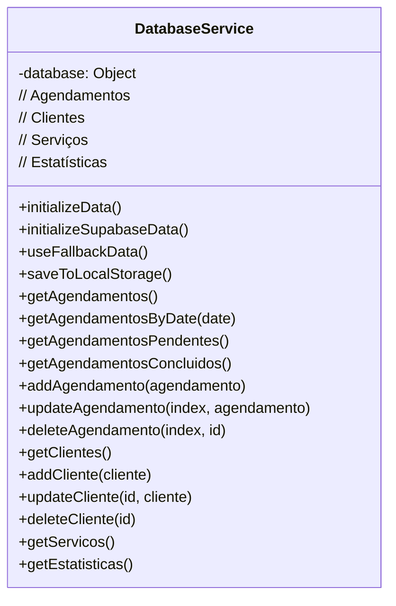
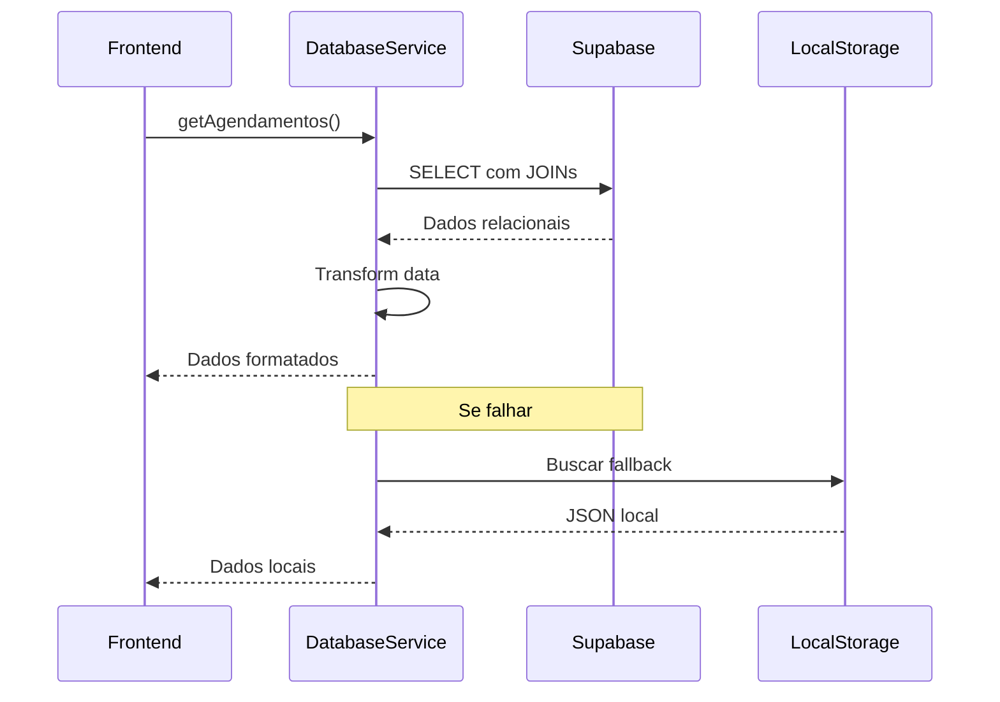
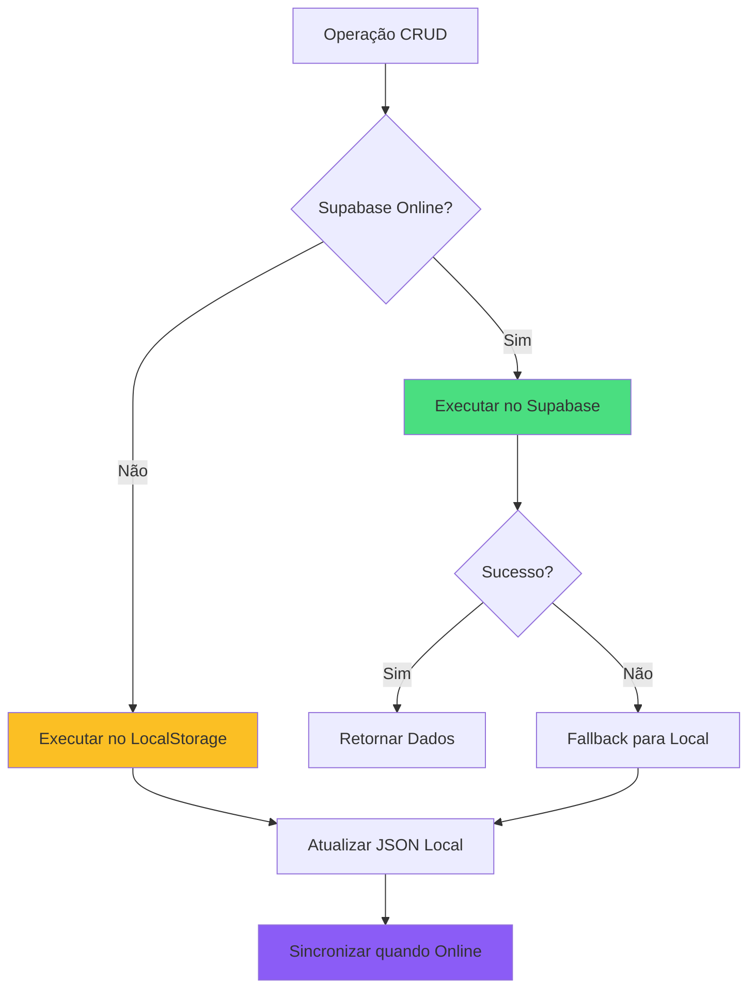

# Conectividade e CRUD - ColdTech

## 📋 Visão Geral

O sistema ColdTech implementa uma arquitetura híbrida de dados, utilizando **Supabase** como banco principal e **LocalStorage** como fallback, garantindo disponibilidade e performance através de operações CRUD completas.

> **Em termos simples:** O sistema armazena dados em um banco de dados online (Supabase), mas também mantém uma cópia local no navegador. Assim, mesmo se a internet falhar, o sistema continua funcionando.

## 🏗️ Arquitetura de Dados



> **Explicação do diagrama:** Este diagrama mostra como os dados fluem no sistema. O DatabaseService é o componente central que gerencia todas as operações de dados. Quando há conexão com a internet, os dados são armazenados no Supabase (banco de dados na nuvem). Quando não há conexão, o sistema usa o armazenamento local do navegador como backup. As operações CRUD (Criar, Ler, Atualizar, Deletar) funcionam da mesma forma independentemente de onde os dados estão armazenados.

## 🗄️ Estrutura do Banco de Dados

### Tabelas Principais

#### 1. **agendamentos**
```sql
CREATE TABLE agendamentos (
  id SERIAL PRIMARY KEY,
  cliente_id INTEGER REFERENCES clientes(id),
  servico_id INTEGER REFERENCES servicos(id),
  data DATE NOT NULL,
  time TIME NOT NULL,
  local TEXT NOT NULL,
  preco_personalizado DECIMAL(10,2),
  status VARCHAR(20) DEFAULT 'pendente',
  created_at TIMESTAMP DEFAULT NOW(),
  updated_at TIMESTAMP DEFAULT NOW()
);
```

> **O que esta tabela armazena:** Registra todos os compromissos de serviço, incluindo qual cliente solicitou, qual serviço será realizado, data, hora, local e status atual (pendente, concluído, cancelado).

#### 2. **clientes**
```sql
CREATE TABLE clientes (
  id SERIAL PRIMARY KEY,
  nome VARCHAR(255) NOT NULL,
  contato VARCHAR(50) NOT NULL,
  endereco TEXT,
  created_at TIMESTAMP DEFAULT NOW(),
  updated_at TIMESTAMP DEFAULT NOW()
);
```

> **O que esta tabela armazena:** Contém informações de todos os clientes da empresa, incluindo nome, telefone/email para contato e endereço para visitas técnicas.

#### 3. **servicos**
```sql
CREATE TABLE servicos (
  id SERIAL PRIMARY KEY,
  tipo VARCHAR(255) NOT NULL,
  descricao TEXT,
  preco_base DECIMAL(10,2),
  created_at TIMESTAMP DEFAULT NOW()
);
```

> **O que esta tabela armazena:** Lista todos os tipos de serviços oferecidos pela empresa, com descrições detalhadas e preços base para orçamentos.

#### 4. **usuarios**
```sql
CREATE TABLE usuarios (
  id SERIAL PRIMARY KEY,
  nome VARCHAR(255) NOT NULL,
  email VARCHAR(255) UNIQUE NOT NULL,
  senha VARCHAR(255) NOT NULL,
  ultimo_login TIMESTAMP,
  created_at TIMESTAMP DEFAULT NOW()
);
```

> **O que esta tabela armazena:** Cadastro de funcionários que podem acessar o sistema administrativo, com controle de último acesso para segurança.

## 🔌 Configuração de Conectividade

### Supabase Client
```javascript
// supabaseClient.js
import { createClient } from '@supabase/supabase-js';

const supabaseUrl = import.meta.env.VITE_SUPABASE_URL;
const supabaseAnonKey = import.meta.env.VITE_SUPABASE_ANON_KEY;

const supabase = createClient(supabaseUrl, supabaseAnonKey);
export default supabase;
```

> **O que este código faz:** Configura a conexão com o banco de dados Supabase usando variáveis de ambiente para manter as credenciais seguras. Este cliente será usado em todo o sistema para operações de banco de dados.

### Variáveis de Ambiente
```env
VITE_SUPABASE_URL=https://seu-projeto.supabase.co
VITE_SUPABASE_ANON_KEY=sua-chave-anonima
```

> **Por que usar variáveis de ambiente:** Mantém informações sensíveis fora do código-fonte, permitindo diferentes configurações para ambientes de desenvolvimento, teste e produção sem alterar o código.

## 🛠️ DatabaseService - Camada de Abstração

### Estrutura da Classe



> **Explicação do diagrama:** Este diagrama mostra todos os métodos disponíveis no DatabaseService, que é a classe central para gerenciamento de dados. Ela oferece funções para inicializar dados, gerenciar o fallback local e realizar todas as operações CRUD para agendamentos, clientes e serviços.

## 📊 Operações CRUD Detalhadas

> **O que é CRUD?** CRUD é um acrônimo para as quatro operações básicas em banco de dados: Create (Criar), Read (Ler), Update (Atualizar) e Delete (Excluir). Estas operações são a base de qualquer sistema que gerencia dados.

### 1. **CREATE (Criar)**

#### Agendamentos
```javascript
async addAgendamento(agendamento) {
  try {
    // 1. Buscar ou criar cliente
    let cliente_id;
    const { data: clienteExistente } = await supabase
      .from('clientes')
      .select('id')
      .eq('nome', agendamento.cliente)
      .single();
    
    if (clienteExistente) {
      cliente_id = clienteExistente.id;
    } else {
      // Criar novo cliente
      const { data: novoCliente } = await supabase
        .from('clientes')
        .insert({
          nome: agendamento.cliente,
          contato: agendamento.contato,
          endereco: agendamento.local
        })
        .select('id')
        .single();
      
      cliente_id = novoCliente.id;
    }
    
    // 2. Buscar serviço
    const { data: servico } = await supabase
      .from('servicos')
      .select('id')
      .eq('tipo', agendamento.servico)
      .single();
    
    // 3. Inserir agendamento
    const { data, error } = await supabase
      .from('agendamentos')
      .insert({
        cliente_id,
        servico_id: servico.id,
        data: agendamento.data,
        time: agendamento.time,
        local: agendamento.local,
        preco_personalizado: agendamento.preco,
        status: agendamento.status
      })
      .select(`
        *,
        clientes (nome, contato),
        servicos (tipo)
      `)
      .single();
    
    return transformedData;
  } catch (error) {
    // Fallback para localStorage
    return this.fallbackCreate(agendamento);
  }
}
```

> **O que este código faz:** Quando um novo agendamento é criado, o sistema primeiro verifica se o cliente já existe. Se não existir, cria um novo registro de cliente. Em seguida, busca o serviço solicitado e finalmente cria o agendamento relacionando cliente e serviço. Se ocorrer algum erro (como falta de conexão), o sistema usa o armazenamento local como fallback.

### 2. **READ (Ler)**

#### Fluxo de Leitura


> **Explicação do diagrama:** Este diagrama mostra o fluxo de uma operação de leitura. Quando o frontend solicita dados, o DatabaseService tenta buscá-los no Supabase. Se for bem-sucedido, os dados são transformados para o formato esperado pela aplicação e retornados. Se falhar, o sistema busca os dados no armazenamento local como alternativa.

#### Consultas com Relacionamentos
```javascript
async getAgendamentos() {
  try {
    const { data, error } = await supabase
      .from('agendamentos')
      .select(`
        *,
        clientes (nome, contato),
        servicos (tipo)
      `)
      .order('data', { ascending: true });
    
    // Transformar para formato da aplicação
    return data.map(item => ({
      id: item.id,
      cliente: item.clientes?.nome || '',
      contato: item.clientes?.contato || '',
      servico: item.servicos?.tipo || '',
      data: item.data,
      time: item.time,
      local: item.local,
      preco: item.preco_personalizado,
      status: item.status
    }));
  } catch (error) {
    return this.database?.agendamentos || [];
  }
}
```

> **O que este código faz:** Busca todos os agendamentos no banco de dados, incluindo informações relacionadas de clientes e serviços em uma única consulta. Os dados são ordenados por data e transformados para um formato mais fácil de usar na interface. Se a consulta falhar, retorna dados do armazenamento local.

### 3. **UPDATE (Atualizar)**

#### Processo de Atualização
```javascript
async updateAgendamento(index, agendamento) {
  try {
    // Validar ID
    if (!agendamento.id) {
      throw new Error('ID do agendamento não fornecido');
    }
    
    // Buscar serviço atualizado
    const { data: servico } = await supabase
      .from('servicos')
      .select('id')
      .eq('tipo', agendamento.servico)
      .single();
    
    // Atualizar no banco
    const { data, error } = await supabase
      .from('agendamentos')
      .update({
        data: agendamento.data,
        time: agendamento.time,
        servico_id: servico.id,
        preco_personalizado: agendamento.preco,
        status: agendamento.status
      })
      .eq('id', agendamento.id)
      .select()
      .single();
    
    return transformedData;
  } catch (error) {
    // Fallback local
    return this.fallbackUpdate(index, agendamento);
  }
}
```

> **O que este código faz:** Atualiza um agendamento existente no banco de dados. Primeiro valida se o ID foi fornecido, depois busca o serviço correspondente e finalmente atualiza os dados do agendamento. Se ocorrer algum erro, utiliza o fallback local para manter a consistência dos dados.

### 4. **DELETE (Excluir)**

#### Exclusão Segura
```javascript
async deleteAgendamento(index, id) {
  try {
    if (!id) {
      throw new Error('ID do agendamento não fornecido');
    }
    
    const { error } = await supabase
      .from('agendamentos')
      .delete()
      .eq('id', id);
    
    if (error) throw error;
    return true;
  } catch (error) {
    // Fallback para exclusão local
    return this.fallbackDelete(index);
  }
}
```

> **O que este código faz:** Remove um agendamento do banco de dados com base no ID fornecido. Inclui validação para garantir que o ID existe e tratamento de erros para casos de falha na conexão, quando então utiliza o fallback local.

## 🔄 Sistema de Fallback

### Estratégia Híbrida


> **Explicação do diagrama:** Este diagrama ilustra a estratégia de fallback do sistema. Quando uma operação CRUD é iniciada, o sistema verifica se há conexão com o Supabase. Se estiver online, executa a operação no banco de dados remoto. Se estiver offline ou a operação falhar, utiliza o armazenamento local. Quando a conexão for restaurada, os dados locais serão sincronizados com o banco remoto.

### Implementação do Fallback
```javascript
useFallbackData() {
  const savedData = localStorage.getItem('coldtech_database');
  if (savedData) {
    this.database = JSON.parse(savedData);
  } else {
    this.database = databaseData; // JSON inicial
    this.saveToLocalStorage();
  }
}

saveToLocalStorage() {
  localStorage.setItem('coldtech_database', JSON.stringify(this.database));
}
```

> **O que este código faz:** Gerencia o armazenamento local de dados como backup. Quando necessário, carrega dados do localStorage ou inicializa com dados padrão do arquivo JSON. Também salva alterações no localStorage para persistência entre sessões.

## 📈 Estatísticas e Relatórios

### Consultas Agregadas
```javascript
async getEstatisticas() {
  try {
    const hoje = new Date().toISOString().split('T')[0];
    
    // Múltiplas consultas paralelas
    const [
      { count: totalAgendamentos },
      { count: pendentes },
      { count: concluidos },
      { count: clientesUnicos },
      { count: agendamentosHoje }
    ] = await Promise.all([
      supabase.from('agendamentos').select('*', { count: 'exact', head: true }),
      supabase.from('agendamentos').select('*', { count: 'exact', head: true }).eq('status', 'pendente'),
      supabase.from('agendamentos').select('*', { count: 'exact', head: true }).eq('status', 'concluido'),
      supabase.from('clientes').select('*', { count: 'exact', head: true }),
      supabase.from('agendamentos').select('*', { count: 'exact', head: true }).eq('data', hoje)
    ]);
    
    return {
      totalAgendamentos: totalAgendamentos || 0,
      pendentes: pendentes || 0,
      concluidos: concluidos || 0,
      clientesUnicos: clientesUnicos || 0,
      agendamentosHoje: agendamentosHoje || 0
    };
  } catch (error) {
    return this.calculateLocalStats();
  }
}
```

> **O que este código faz:** Gera estatísticas importantes para o dashboard administrativo, como total de agendamentos, pendentes, concluídos, número de clientes únicos e agendamentos do dia atual. Utiliza consultas paralelas para melhor performance e tem fallback para cálculo local em caso de falha na conexão.

## 🔍 Filtros e Consultas Avançadas

### Filtros por Data
```javascript
async getAgendamentosByDate(date) {
  const { data } = await supabase
    .from('agendamentos')
    .select(`
      *,
      clientes (nome, contato),
      servicos (tipo)
    `)
    .eq('data', date)
    .order('time', { ascending: true });
  
  return this.transformData(data);
}
```

> **O que este código faz:** Permite filtrar agendamentos por uma data específica, ordenando-os por horário. Isso é útil para visualizar a agenda de um dia específico ou verificar disponibilidade de horários.

### Filtros por Status
```javascript
async getAgendamentosPendentes() {
  return this.getAgendamentosByStatus('pendente');
}

async getAgendamentosConcluidos() {
  return this.getAgendamentosByStatus('concluido');
}
```

> **O que este código faz:** Oferece métodos específicos para filtrar agendamentos por status, facilitando a visualização de compromissos pendentes ou concluídos para melhor organização do trabalho.

## 🚀 Otimizações de Performance

### 1. **Caching**
```javascript
class DatabaseService {
  constructor() {
    this.cache = new Map();
    this.cacheTimeout = 5 * 60 * 1000; // 5 minutos
  }
  
  async getCachedData(key, fetchFunction) {
    const cached = this.cache.get(key);
    if (cached && Date.now() - cached.timestamp < this.cacheTimeout) {
      return cached.data;
    }
    
    const data = await fetchFunction();
    this.cache.set(key, { data, timestamp: Date.now() });
    return data;
  }
}
```

> **O que este código faz:** Implementa um sistema de cache em memória para reduzir consultas repetidas ao banco de dados. Os dados são armazenados temporariamente (por 5 minutos) e reutilizados quando a mesma consulta é feita novamente nesse período, melhorando significativamente a performance.

### 2. **Batch Operations**
```javascript
async batchUpdateAgendamentos(updates) {
  const promises = updates.map(update => 
    this.updateAgendamento(update.index, update.data)
  );
  
  return Promise.allSettled(promises);
}
```

> **O que este código faz:** Permite atualizar múltiplos agendamentos em uma única operação, reduzindo o número de requisições ao servidor e melhorando a performance em operações em massa, como mudança de status de vários agendamentos.

### 3. **Lazy Loading**
```javascript
async getAgendamentosPaginated(page = 1, limit = 10) {
  const offset = (page - 1) * limit;
  
  const { data } = await supabase
    .from('agendamentos')
    .select(`
      *,
      clientes (nome, contato),
      servicos (tipo)
    `)
    .range(offset, offset + limit - 1)
    .order('data', { ascending: false });
  
  return this.transformData(data);
}
```

> **O que este código faz:** Implementa paginação para carregar apenas um subconjunto de dados por vez, essencial para lidar com grandes volumes de agendamentos sem sobrecarregar a memória do navegador ou a conexão de rede.

## 🔒 Segurança e Validação

### Row Level Security (RLS)
```sql
-- Política para agendamentos
CREATE POLICY "Usuários podem ver seus agendamentos" ON agendamentos
  FOR SELECT USING (auth.uid() = user_id);

CREATE POLICY "Usuários podem inserir agendamentos" ON agendamentos
  FOR INSERT WITH CHECK (auth.uid() = user_id);
```

> **O que este código faz:** Configura políticas de segurança no nível do banco de dados, garantindo que usuários só possam acessar e modificar dados relacionados a eles, mesmo se conseguirem acesso direto ao banco de dados.

### Validação de Dados
```javascript
validateAgendamento(agendamento) {
  const errors = [];
  
  if (!agendamento.cliente) errors.push('Cliente é obrigatório');
  if (!agendamento.data) errors.push('Data é obrigatória');
  if (!agendamento.time) errors.push('Horário é obrigatório');
  
  if (errors.length > 0) {
    throw new Error(errors.join(', '));
  }
}
```

> **O que este código faz:** Verifica se todos os campos obrigatórios estão preenchidos antes de salvar um agendamento, evitando dados incompletos e garantindo a integridade do banco de dados.

## 📊 Monitoramento e Logs

### Error Tracking
```javascript
logError(operation, error, context = {}) {
  console.error(`DatabaseService.${operation}:`, {
    error: error.message,
    stack: error.stack,
    context,
    timestamp: new Date().toISOString()
  });
  
  // Enviar para serviço de monitoramento
  // analytics.track('database_error', { operation, error: error.message });
}
```

> **O que este código faz:** Registra erros de forma estruturada, incluindo informações de contexto e stack trace, facilitando a identificação e correção de problemas. Pode ser expandido para enviar logs para serviços de monitoramento externos.

### Performance Monitoring
```javascript
async withPerformanceTracking(operation, fn) {
  const startTime = performance.now();
  
  try {
    const result = await fn();
    const duration = performance.now() - startTime;
    
    console.log(`${operation} completed in ${duration.toFixed(2)}ms`);
    return result;
  } catch (error) {
    this.logError(operation, error);
    throw error;
  }
}
```

> **O que este código faz:** Mede o tempo de execução de operações de banco de dados, permitindo identificar gargalos de performance e otimizar consultas lentas para melhorar a experiência do usuário.

---

**ColdTech** - Sistema de Dados Robusto e Escalável
*Versão 1.0 - Supabase + LocalStorage Hybrid Architecture*
