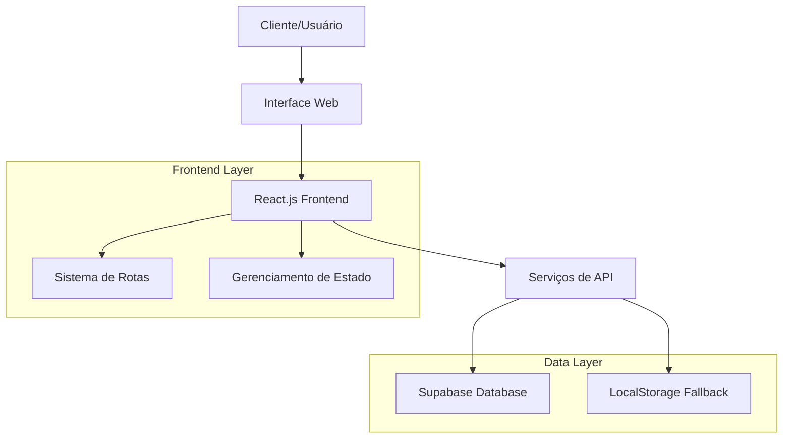
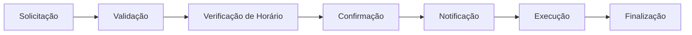

# Escopo do Projeto - ColdTech

## 📋 Visão Geral

O **ColdTech** é um sistema web completo para gerenciamento de serviços de ar-condicionado, desenvolvido em React.js com foco na eficiência operacional e experiência do usuário.

## 🎯 Objetivos do Projeto

### Objetivo Principal
Criar uma plataforma digital que centralize e automatize os processos de agendamento, gerenciamento de clientes e controle de serviços de manutenção de ar-condicionado.

### Objetivos Específicos
- **Automatizar agendamentos** de serviços técnicos
- **Centralizar informações** de clientes e histórico
- **Otimizar gestão** de equipe e recursos
- **Melhorar comunicação** com clientes
- **Gerar relatórios** e estatísticas operacionais

## 🏗️ Arquitetura do Sistema

## 👥 Stakeholders

### Usuários Primários
- **Administradores:** Gestores da empresa ColdTech
- **Técnicos:** Profissionais que executam os serviços
- **Clientes:** Pessoas que solicitam serviços

### Usuários Secundários
- **Atendentes:** Equipe de suporte ao cliente
- **Gerentes:** Supervisores operacionais

## 🔧 Funcionalidades Principais

### 1. **Área Pública**
- **Landing Page** com informações da empresa
- **Formulário de Agendamento** para clientes
- **Seção de Serviços** oferecidos
- **Informações de Contato**
- **Botão WhatsApp** para comunicação rápida

### 2. **Área Administrativa**
- **Dashboard** com métricas e estatísticas
- **Gerenciamento de Agendamentos**
  - Visualizar, criar, editar e excluir
  - Filtros por status e data
  - Controle de horários disponíveis
- **Gestão de Clientes**
  - Cadastro e histórico completo
  - Informações de contato e endereço
- **Controle de Serviços**
  - Tipos de serviço oferecidos
  - Preços e descrições

### 3. **Sistema de Autenticação**
- **Login seguro** para área administrativa
- **Controle de sessão** com localStorage
- **Proteção de rotas** privadas

## 📊 Módulos do Sistema

### Módulo de Agendamentos

### Módulo de Clientes
- **Cadastro:** Nome, contato, endereço
- **Histórico:** Serviços realizados
- **Status:** Ativo/Inativo

### Módulo de Serviços
- **Tipos:** Instalação, manutenção, reparo
- **Preços:** Valores personalizáveis
- **Descrições:** Detalhes técnicos

## 🛠️ Tecnologias Utilizadas

### Frontend
- **React.js 18+** - Framework principal
- **React Router DOM** - Navegação e rotas
- **CSS3** - Estilização responsiva
- **JavaScript ES6+** - Lógica de negócio

### Backend/Database
- **Supabase** - Banco de dados PostgreSQL
- **LocalStorage** - Fallback para dados locais

### Ferramentas de Desenvolvimento
- **Vite** - Build tool e dev server
- **ESLint** - Linting de código
- **Git** - Controle de versão

## 📱 Responsividade

### Dispositivos Suportados
- **Desktop:** 1200px+
- **Tablet:** 768px - 1199px
- **Mobile:** 320px - 767px

### Características Responsivas
- Layout flexível com CSS Grid/Flexbox
- Imagens otimizadas para diferentes telas
- Menu mobile com hamburger
- Formulários adaptáveis

## 🔒 Segurança

### Medidas Implementadas
- **Autenticação** com credenciais seguras
- **Proteção de rotas** administrativas
- **Validação** de dados de entrada
- **Sanitização** de inputs do usuário

### Melhorias Futuras
- Hash bcrypt para senhas
- JWT tokens para sessões
- Rate limiting para APIs
- Auditoria de ações

## 📈 Métricas e KPIs

### Indicadores de Performance
- **Total de Agendamentos** por período
- **Taxa de Conversão** de solicitações
- **Tempo Médio** de resposta
- **Satisfação do Cliente** (futuro)

### Relatórios Disponíveis
- Agendamentos por status
- Faturamento mensal
- Clientes mais ativos
- Serviços mais solicitados

## 🚀 Roadmap de Desenvolvimento

### Fase 1 - MVP ✅
- [x] Interface básica
- [x] Sistema de agendamentos
- [x] Autenticação simples
- [x] CRUD básico

### Fase 2 - Melhorias 🔄
- [ ] Notificações por email/SMS
- [ ] Relatórios avançados
- [ ] App mobile
- [ ] Integração com calendário

### Fase 3 - Expansão 📋
- [ ] Multi-tenancy
- [ ] API pública
- [ ] Integrações terceiros
- [ ] IA para otimização

## 💰 Benefícios Esperados

### Operacionais
- **Redução de 60%** no tempo de agendamento
- **Eliminação de 90%** dos agendamentos duplicados
- **Melhoria de 40%** na organização da agenda

### Financeiros
- **Aumento de 25%** na eficiência operacional
- **Redução de 30%** em custos administrativos
- **Crescimento de 20%** na base de clientes

### Estratégicos
- **Digitalização** completa dos processos
- **Melhoria** na experiência do cliente
- **Escalabilidade** para crescimento futuro

## 📞 Suporte e Manutenção

### Níveis de Suporte
- **Nível 1:** Suporte básico ao usuário
- **Nível 2:** Problemas técnicos
- **Nível 3:** Desenvolvimento e melhorias

### Cronograma de Manutenção
- **Diário:** Backup de dados
- **Semanal:** Monitoramento de performance
- **Mensal:** Atualizações de segurança
- **Trimestral:** Novas funcionalidades

---

**ColdTech** - Transformando a gestão de serviços de ar-condicionado através da tecnologia
*Versão 1.0 - Sistema de Gerenciamento Completo*
