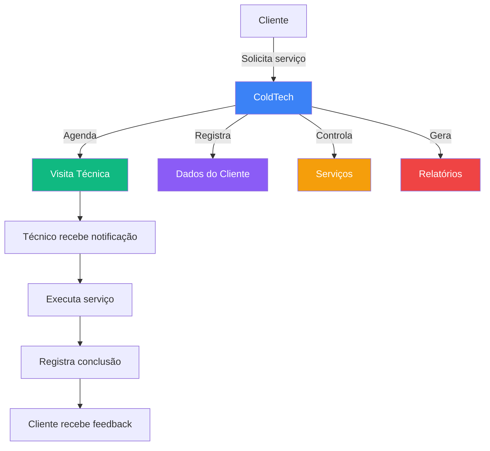
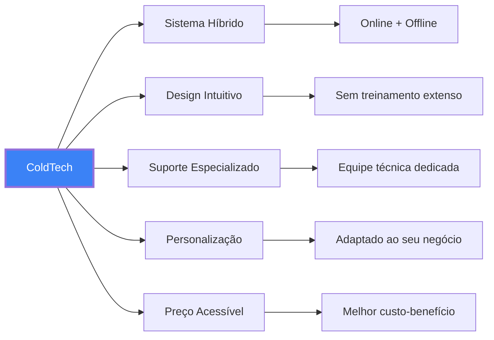

# ColdTech - Sistema de Gerenciamento para Empresas de Ar-Condicionado

  
  <h3>Transforme a gestão do seu negócio de climatização</h3>

## 🚀 Sobre o ColdTech

O **ColdTech** é uma solução completa para empresas de ar-condicionado que desejam otimizar seus processos, aumentar a produtividade e melhorar a experiência do cliente. Nossa plataforma integra agendamentos, gestão de clientes e controle de serviços em um único sistema intuitivo e eficiente.

## 💼 Por que escolher o ColdTech?

### 📈 Aumento de Produtividade
- **Redução de 60%** no tempo dedicado a agendamentos
- **Eliminação de 90%** dos agendamentos duplicados
- **Automação** de tarefas administrativas repetitivas

### 💰 Economia de Recursos
- **Redução de 30%** em custos administrativos
- **Otimização de rotas** para visitas técnicas
- **Controle eficiente** de estoque e peças

### 😊 Satisfação do Cliente
- **Agendamento online** 24 horas por dia
- **Confirmações automáticas** por WhatsApp
- **Histórico completo** de serviços realizados

### 📊 Gestão Inteligente
- **Dashboard** com métricas em tempo real
- **Relatórios detalhados** de performance
- **Previsões** de faturamento e demanda

## 🛠️ Funcionalidades Principais

<table>
  <tr>
    <td width="33%">
      <h3 align="center">🗓️ Agendamentos</h3>
      <ul>
        <li>Calendário visual intuitivo</li>
        <li>Verificação automática de disponibilidade</li>
        <li>Notificações para clientes e técnicos</li>
        <li>Filtros por data, status e técnico</li>
      </ul>
    </td>
    <td width="33%">
      <h3 align="center">👥 Clientes</h3>
      <ul>
        <li>Cadastro completo de informações</li>
        <li>Histórico de serviços realizados</li>
        <li>Preferências e observações</li>
        <li>Segmentação para marketing</li>
      </ul>
    </td>
    <td width="33%">
      <h3 align="center">🔧 Serviços</h3>
      <ul>
        <li>Catálogo personalizado</li>
        <li>Preços e descrições detalhadas</li>
        <li>Tempo estimado de execução</li>
        <li>Materiais necessários</li>
      </ul>
    </td>
  </tr>
</table>

## 🖥️ Demonstração

  
  
<i>Dashboard administrativo com visão geral do negócio</i>

## 🏆 Diferenciais Competitivos

### 🔄 Sistema Híbrido
Funciona mesmo sem internet! Nosso sistema de fallback local garante que você nunca perca dados ou acesso às informações essenciais.

### 📱 100% Responsivo
Acesse de qualquer dispositivo - computador, tablet ou smartphone - com a mesma experiência fluida e completa.

### 🔒 Segurança Avançada
Proteção de dados em conformidade com a LGPD, autenticação segura e backups automáticos.

### ⚡ Performance Otimizada
Carregamento rápido, operações instantâneas e uso eficiente de recursos do sistema.

## 💻 Tecnologias Utilizadas

  
  
  
  
  

## 👨‍💻 Nossa Equipe

<table>
  <tr>
    <td align="center">
       
      <strong>Gabriel Cordeiro</strong> 
      <small>Desenvolvedor Full Stack</small> 
      <a href="https://github.com/GabrielCordeiroBarrosoTeles">GitHub</a>
    </td>
    <td align="center">
       
      <strong>Wilton</strong> 
      <small>UX/UI Designer</small> 
      <a href="https://github.com/wiltondesigner">GitHub</a>
    </td>
    <td align="center">
       
      <strong>João Paulo</strong> 
      <small>Desenvolvedor Full Stack</small> 
      <a href="https://github.com/joao-paulo-paiva">GitHub</a>
    </td>
    <td align="center">
       
      <strong>Fablilson Oliver</strong> 
      <small>Mobile Developer</small> 
      <a href="https://github.com/Fablilsonoliver">GitHub</a>
    </td>
  </tr>
</table>

## 📊 Planos e Preços

<table>
  <tr>
    <th>Plano Básico</th>
    <th>Plano Profissional</th>
    <th>Plano Empresarial</th>
  </tr>
  <tr>
    <td>
      <ul>
        <li>Até 50 agendamentos/mês</li>
        <li>Cadastro de 100 clientes</li>
        <li>5 usuários</li>
        <li>Suporte por email</li>
      </ul>
      <h3 align="center">R$ 199/mês</h3>
    </td>
    <td>
      <ul>
        <li>Até 200 agendamentos/mês</li>
        <li>Cadastro ilimitado de clientes</li>
        <li>15 usuários</li>
        <li>Suporte prioritário</li>
        <li>Relatórios avançados</li>
      </ul>
      <h3 align="center">R$ 399/mês</h3>
    </td>
    <td>
      <ul>
        <li>Agendamentos ilimitados</li>
        <li>Cadastro ilimitado de clientes</li>
        <li>Usuários ilimitados</li>
        <li>Suporte 24/7</li>
        <li>Personalização completa</li>
        <li>API para integrações</li>
      </ul>
      <h3 align="center">R$ 799/mês</h3>
    </td>
  </tr>
</table>

## 📞 Entre em Contato

  
  
  

  <h3>Transforme sua empresa de ar-condicionado com o ColdTech!</h3>
  
Agende uma demonstração gratuita hoje mesmo.

---

  
© 2023 ColdTech - Todos os direitos reservados

  <small>Desenvolvido com ❤️ pela equipe ColdTech</small>

