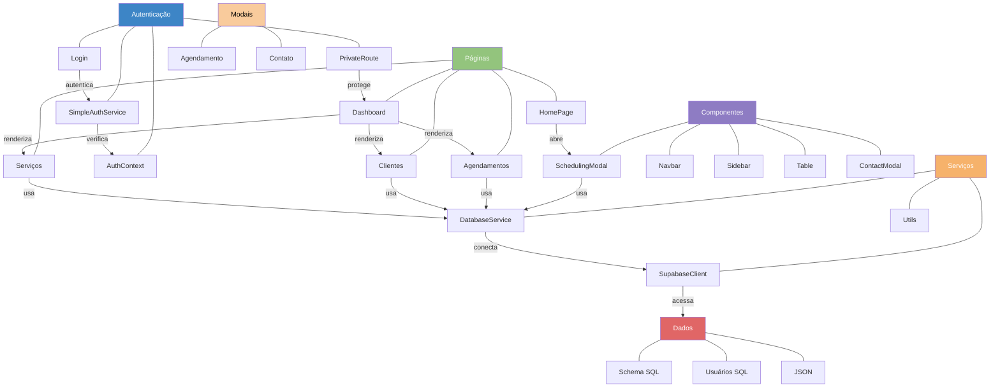

# ColdTech - Sistema de Gerenciamento de Agendamentos

## Sobre o Projeto

Sistema de gerenciamento de agendamentos para serviços de manutenção, instalação e outros serviços relacionados a refrigeração. O sistema permite controlar agendamentos, clientes, serviços e gerar relatórios de faturamento.

## Tecnologias Utilizadas

- React 
- Vite
- Supabase (Banco de dados PostgreSQL)
- React Router (Navegação)
- Context API (Gerenciamento de estado)

## Configuração do Projeto

### Pré-requisitos

- Node.js (v14 ou superior)
- npm ou yarn
- Conta no Supabase

### Instalação

1. Clone o repositório
2. Instale as dependências:
   ```
   npm install
   ```
3. Configure as variáveis de ambiente:
   - Crie um arquivo `.env` na raiz do projeto com as seguintes variáveis:
   ```
   VITE_SUPABASE_URL=sua_url_do_supabase
   VITE_SUPABASE_ANON_KEY=sua_chave_anonima_do_supabase
   ```

### Configuração do Banco de Dados

1. Crie um projeto no Supabase
2. Execute os scripts SQL na seguinte ordem:
   - `supabase/schema.sql` - Cria as tabelas principais (serviços, clientes, agendamentos)
   - `supabase/usuarios.sql` - Cria a tabela de usuários para autenticação

### Credenciais de Acesso

- **Email**: admin@coldtech.com
- **Senha**: admin123

### Desenvolvimento

Para iniciar o servidor de desenvolvimento:

```
npm run dev
```

### Build

Para criar uma versão de produção:

```
npm run build
```

## Deploy

### Deploy no Vercel

1. Crie uma conta no [Vercel](https://vercel.com)
2. Conecte seu repositório GitHub ao Vercel
3. Configure as variáveis de ambiente:
   - `VITE_SUPABASE_URL`: URL do seu projeto Supabase
   - `VITE_SUPABASE_ANON_KEY`: Chave anônima do seu projeto Supabase
4. Defina as configurações de build:
   - Framework Preset: Vite
   - Build Command: `npm run build`
   - Output Directory: `dist`
5. Clique em "Deploy"

### Solução de Problemas de Deploy

Se encontrar problemas com dependências durante o deploy:

1. Verifique se todas as dependências estão corretamente listadas no `package.json`
2. Use a configuração atualizada do `vercel.json`:
   ```json
   {
     "version": 2,
     "buildCommand": "npm run build",
     "installCommand": "npm install --legacy-peer-deps",
     "outputDirectory": "dist",
     "routes": [
       { "handle": "filesystem" },
       { "src": "/(.*)", "dest": "/index.html" }
     ]
   }
   ```
3. Crie um arquivo `.npmrc` na raiz do projeto com o seguinte conteúdo:
   ```
   legacy-peer-deps=true
   ```
4. Para conflitos de dependências específicos (como lucide-react), atualize para versões compatíveis com React 18
5. Use `vite build` diretamente no script de build do package.json em vez de scripts personalizados

## Arquitetura do Sistema



## Estrutura do Projeto

- `/src/components` - Componentes reutilizáveis
- `/src/pages` - Páginas da aplicação
  - `/Admin` - Área administrativa protegida
  - `/Admin/components` - Componentes específicos da área administrativa
- `/src/contexts` - Contextos React (AuthContext)
- `/src/services` - Serviços para comunicação com APIs e banco de dados
- `/src/routes` - Configuração de rotas e proteção de rotas
- `/src/utils` - Utilitários
- `/src/data` - Dados estáticos e modelos
- `/supabase` - Scripts SQL e configurações do Supabase

## Funcionalidades

- **Autenticação**: Sistema de login seguro
- **Agendamentos**: Cadastro, edição e exclusão de agendamentos
- **Clientes**: Gerenciamento de clientes
- **Serviços**: Configuração de tipos de serviços e preços
- **Dashboard**: Visão geral com estatísticas e faturamento
- **Relatórios**: Previsão de faturamento e faturamento realizado
- **Agendamento Online**: Modal para solicitação de agendamentos pelo cliente

## Segurança

- Rotas protegidas com autenticação
- Validação de dados no cliente e servidor
- Verificação de conflitos de horários em agendamentos
