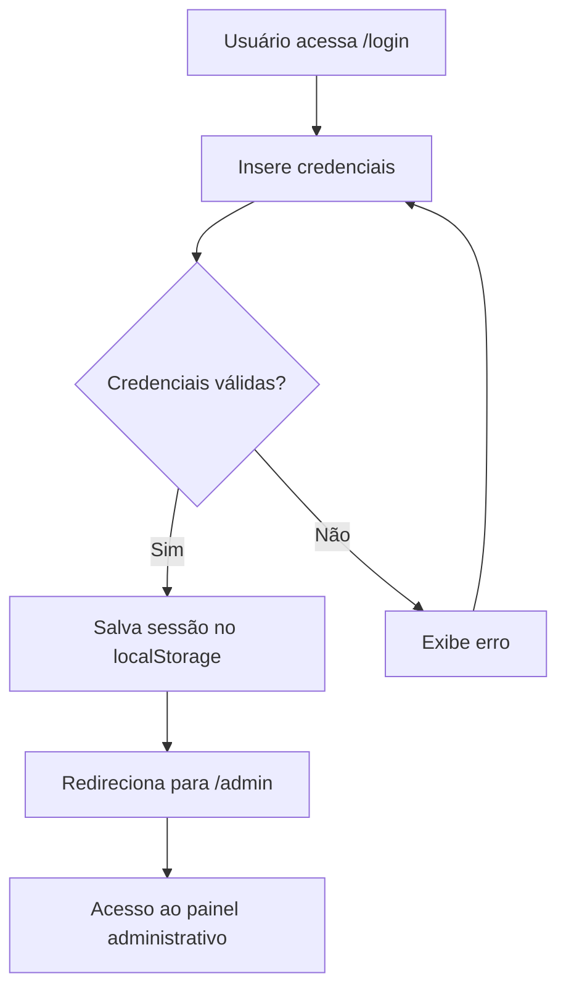

# Sistema de Login - ColdTech

## 📋 Visão Geral

O sistema ColdTech possui um painel administrativo protegido por autenticação, permitindo que apenas usuários autorizados acessem as funcionalidades de gerenciamento de agendamentos, clientes e serviços.

## 🔐 Credenciais de Acesso

### Credenciais Temporárias (Desenvolvimento)
- **Email:** `admin@coldtech.com`
- **Senha:** `admin123`

> ⚠️ **Importante:** Estas são credenciais temporárias para desenvolvimento. Em produção, devem ser alteradas por credenciais seguras.

## 🚪 Como Acessar o Painel

### 1. Navegação para Login
- Acesse a página inicial do sistema
- Clique em **"Área Restrita"** no menu de navegação
- Ou acesse diretamente: `https://seudominio.com/login`

### 2. Processo de Login
1. **Inserir Credenciais**
   - Digite o email: `admin@coldtech.com`
   - Digite a senha: `admin123`

2. **Validação**
   - O sistema valida se os campos estão preenchidos
   - Verifica as credenciais contra o banco de dados
   - Exibe mensagens de erro em caso de falha

3. **Redirecionamento**
   - Após login bem-sucedido, redireciona para `/admin`
   - Usuário permanece logado até fazer logout

## 🔒 Segurança e Hash de Senhas

### Implementação Atual
```javascript
// Verificação simplificada (desenvolvimento)
if (email === 'admin@coldtech.com' && senha === 'admin123') {
  // Login autorizado
}
```

### Sistema de Hash (Preparado para Produção)
```javascript
// utils/hashPassword.js
export async function hashPassword(password) {
  // Em produção, usar biblioteca como bcryptjs
  return `hashed_${password}`;
}

export async function comparePassword(password, hashedPassword) {
  // Comparação segura de senhas
  return `hashed_${password}` === hashedPassword;
}
```

### Melhorias de Segurança Recomendadas
1. **Hash Bcrypt:** Implementar bcryptjs para hash seguro
2. **Salt:** Adicionar salt único para cada senha
3. **JWT Tokens:** Implementar tokens JWT para sessões
4. **Rate Limiting:** Limitar tentativas de login
5. **2FA:** Autenticação de dois fatores

## 💾 Gerenciamento de Sessão

### LocalStorage
```javascript
// Armazenamento da sessão
localStorage.setItem('coldtech_user', JSON.stringify({
  id: usuario.id,
  email: usuario.email,
  nome: usuario.nome,
  isAuthenticated: true
}));
```

### Verificação de Autenticação
```javascript
isAuthenticated() {
  const user = localStorage.getItem('coldtech_user');
  if (!user) return false;
  
  try {
    const userData = JSON.parse(user);
    return userData.isAuthenticated === true;
  } catch {
    return false;
  }
}
```

## 🛡️ Proteção de Rotas

### PrivateRoute Component
- Verifica se o usuário está autenticado
- Redireciona para login se não autenticado
- Protege todas as rotas `/admin/*`

### Rotas Protegidas
- `/admin` - Dashboard principal
- `/admin/agendamentos` - Gerenciar agendamentos
- `/admin/clientes` - Gerenciar clientes
- `/admin/servicos` - Gerenciar serviços
- `/admin/configuracoes` - Configurações do sistema

## 🔄 Fluxo de Autenticação



## 📱 Interface de Login

### Características
- **Design Responsivo:** Funciona em desktop e mobile
- **Validação em Tempo Real:** Feedback imediato de erros
- **Loading States:** Indicadores visuais durante o processo
- **Acessibilidade:** Labels e placeholders apropriados

### Elementos Visuais
- Gradiente azul corporativo
- Logo da ColdTech
- Campos de entrada estilizados
- Botão com estados hover e loading
- Mensagens de erro destacadas

## 🔧 Configuração Técnica

### Dependências
```json
{
  "react-router-dom": "^6.x.x",
  "react": "^18.x.x"
}
```

### Estrutura de Arquivos
```
src/
├── contexts/AuthContext.jsx      # Contexto de autenticação
├── services/simpleAuthService.js # Serviço de autenticação
├── utils/hashPassword.js         # Utilitários de hash
├── pages/Admin/Login.jsx         # Página de login
└── routes/PrivateRoute.jsx       # Proteção de rotas
```

## 🚀 Próximos Passos

### Para Produção
1. **Implementar hash bcrypt real**
2. **Configurar banco de dados de usuários**
3. **Adicionar sistema de recuperação de senha**
4. **Implementar logs de auditoria**
5. **Configurar HTTPS obrigatório**

### Melhorias de UX
1. **Lembrar usuário (Remember me)**
2. **Logout automático por inatividade**
3. **Notificações de sessão expirada**
4. **Tema escuro/claro**

## 📞 Suporte

Para dúvidas sobre o sistema de login:
- **Email:** suporte@coldtech.com
- **Telefone:** (85) 99775-2571
- **Documentação:** Consulte este arquivo

---

**ColdTech** - Sistema de Gerenciamento de Ar Condicionado
*Versão 1.0 - Desenvolvido com React.js*
