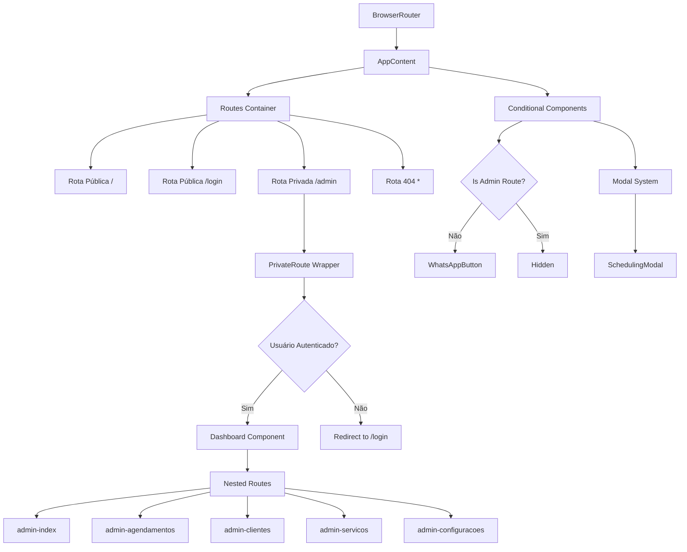
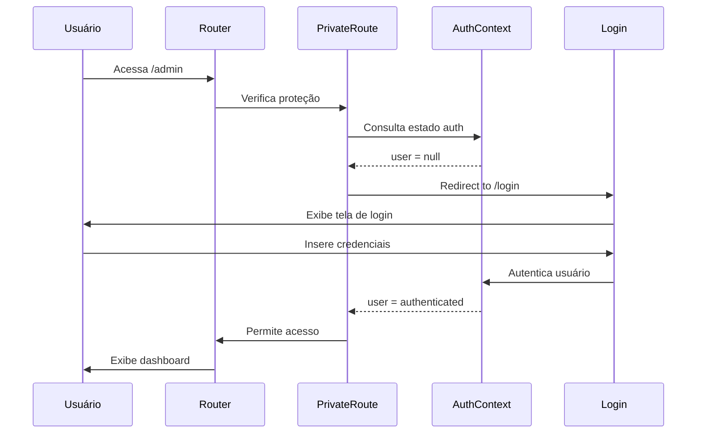
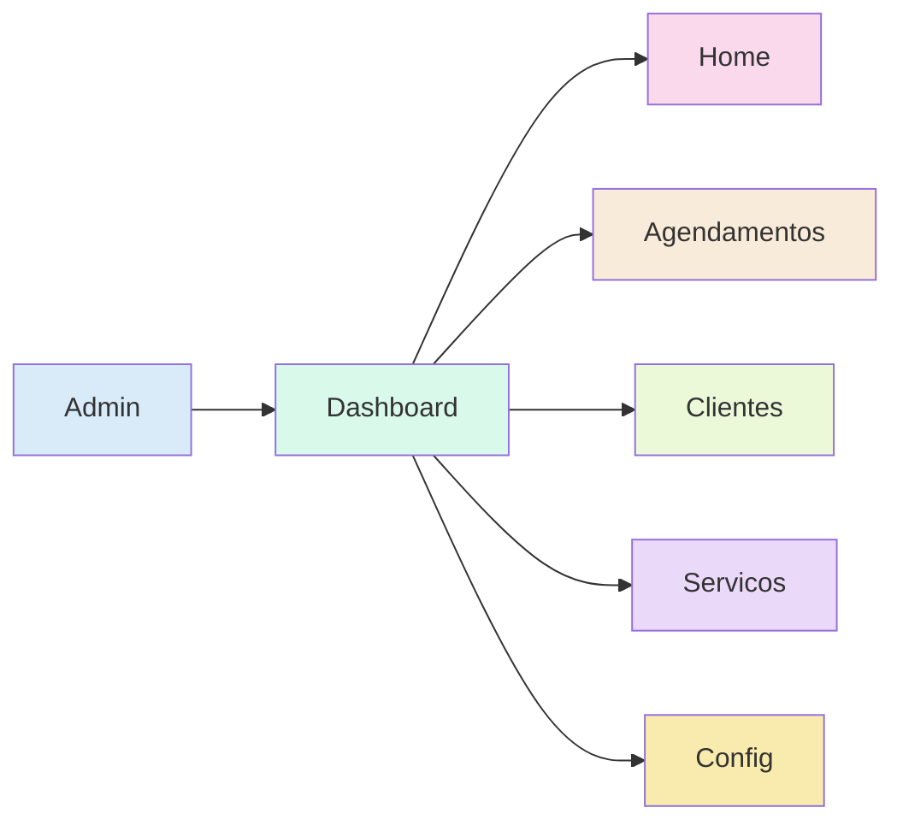

# Sistema de Rotas - ColdTech

## 📋 Visão Geral

O sistema de rotas do ColdTech utiliza **React Router DOM v6** para gerenciar a navegação entre páginas, implementando rotas públicas e privadas com proteção de acesso baseada em autenticação.

> **Em termos simples:** O sistema de rotas é como o "mapa de navegação" do site, definindo quais páginas existem, como acessá-las e quem pode vê-las.

## 🗺️ Mapa de Rotas

### Rotas Públicas
- `/` - Página inicial (HomePage)
- `/login` - Página de autenticação
- `*` - Página 404 (NotFoundPage)

### Rotas Privadas (Protegidas)
- `/admin` - Dashboard principal
- `/admin/agendamentos` - Gerenciar agendamentos
- `/admin/clientes` - Gerenciar clientes
- `/admin/servicos` - Gerenciar serviços
- `/admin/configuracoes` - Configurações do sistema

> **Por que separar rotas públicas e privadas?** Esta separação garante que informações sensíveis e ferramentas administrativas estejam disponíveis apenas para usuários autorizados, enquanto mantém o acesso público às informações gerais da empresa.

## 🏗️ Arquitetura do Sistema de Rotas



> **Explicação do diagrama:** Este diagrama mostra como o sistema de rotas está organizado. O `BrowserRouter` é o componente principal que gerencia todas as rotas. Quando um usuário tenta acessar uma rota privada (`/admin`), o sistema verifica se ele está autenticado. Se estiver, mostra o conteúdo; se não, redireciona para a página de login. Além disso, alguns componentes como o botão de WhatsApp só aparecem em rotas públicas.

## 📁 Estrutura de Arquivos

```
src/routes/
├── index.jsx           # Configuração principal das rotas
├── PrivateRoute.jsx    # Componente de proteção de rotas
└── README.md          # Documentação das rotas
```

> **Por que esta organização?** Manter os arquivos relacionados a rotas em uma pasta separada facilita a manutenção e torna o código mais organizado, seguindo o princípio de "separação de responsabilidades".

## 🔐 Sistema de Proteção de Rotas

### PrivateRoute Component

```javascript
const PrivateRoute = ({ children }) => {
  const { user, loading } = useContext(AuthContext);
  
  // Estado de carregamento
  if (loading) {
    return <LoadingScreen />;
  }
  
  // Verificação de autenticação
  if (!user) {
    return <Navigate to="/login" replace />;
  }
  
  // Renderizar conteúdo protegido
  return children;
};
```

> **Como funciona:** Este componente age como um "segurança" que verifica se o usuário está autenticado antes de permitir acesso a áreas restritas. Se o usuário não estiver logado, ele é automaticamente redirecionado para a página de login.

### Fluxo de Autenticação



> **Explicação do diagrama:** Este diagrama mostra a sequência de eventos quando um usuário tenta acessar uma área protegida. O sistema verifica se o usuário está autenticado consultando o AuthContext. Se não estiver, redireciona para a página de login. Após autenticação bem-sucedida, o usuário é direcionado para a página solicitada originalmente.

## 🧭 Configuração das Rotas

### Rota Principal (AppRoutes)

```javascript
export default function AppRoutes() {
  return (
    <BrowserRouter>
      <AppContent />
    </BrowserRouter>
  );
}
```

> **O que é o BrowserRouter?** É o componente principal do React Router que utiliza a API de History do navegador para sincronizar a interface com a URL atual, permitindo navegação sem recarregar a página inteira.

### Container de Conteúdo (AppContent)

```javascript
function AppContent() {
  const location = useLocation();
  const [isModalOpen, setIsModalOpen] = useState(false);
  const isAdminRoute = location.pathname.startsWith('/admin');

  return (
    <>
      <Routes>
        {/* Rotas definidas aqui */}
      </Routes>
      {!isAdminRoute && <WhatsAppButton />}
      {isModalOpen && <SchedulingModal />}
    </>
  );
}
```

> **Por que usar um componente separado?** O AppContent permite acessar hooks como useLocation e useState, que não podem ser usados diretamente no componente principal. Isso também facilita a renderização condicional de elementos como o botão de WhatsApp.

## 🔄 Rotas Aninhadas (Nested Routes)

### Estrutura Hierárquica



> **Explicação do diagrama:** Este diagrama mostra como as rotas administrativas estão organizadas hierarquicamente. O layout do Dashboard é compartilhado entre todas as sub-rotas, permitindo manter elementos comuns como o menu lateral e o cabeçalho.

### Implementação

```javascript
<Route path="/admin" element={
  <PrivateRoute>
    <Dashboard />
  </PrivateRoute>
}>
  <Route index element={<DashboardHome />} />
  <Route path="agendamentos" element={<AgendamentosAdmin />} />
  <Route path="clientes" element={<ClientesAdmin />} />
  <Route path="servicos" element={<ServicosAdmin />} />
  <Route path="configuracoes" element={<ConfiguracoesComponent />} />
</Route>
```

> **Benefício das rotas aninhadas:** Esta abordagem permite que todas as páginas administrativas compartilhem o mesmo layout (menu, cabeçalho, rodapé), enquanto apenas o conteúdo central muda. Isso melhora a experiência do usuário e reduz código duplicado.

## 🎯 Navegação Condicional

### WhatsApp Button
- **Exibido:** Rotas públicas (`/`, `/login`, `404`)
- **Oculto:** Rotas administrativas (`/admin/*`)

```javascript
const isAdminRoute = location.pathname.startsWith('/admin');
{!isAdminRoute && <WhatsAppButton />}
```

> **Por que ocultar em rotas admin?** O botão de WhatsApp é uma ferramenta para clientes entrarem em contato, não sendo necessário na área administrativa. Isso mantém a interface limpa e focada nas tarefas relevantes para cada contexto.

### Modal System
- **SchedulingModal:** Controlado globalmente
- **Acessível:** De qualquer rota pública
- **Estado:** Gerenciado no AppContent

> **Vantagem desta abordagem:** Centralizar o controle do modal no AppContent permite que qualquer componente em qualquer rota possa abrir o modal de agendamento, proporcionando uma experiência consistente para o usuário.

## 📱 Navegação Responsiva

### Menu Principal (Navbar)
```javascript
const isHomePage = location.pathname === '/';

{isHomePage ? (
  // Links para seções da página inicial
  <>
    <a href="#servicos">Serviços</a>
    <a href="#cta">Contato</a>
    <Link to="/login">Área Restrita</Link>
  </>
) : (
  // Links para navegação geral
  <>
    <a onClick={() => navigateToSection('#servicos')}>Serviços</a>
    <a onClick={() => navigateToSection('#cta')}>Contato</a>
  </>
)}
```

> **Navegação inteligente:** O menu se adapta conforme a página atual. Na página inicial, os links rolam para seções da mesma página. Em outras páginas, os links levam o usuário de volta à página inicial na seção correspondente.

## 🔍 Tratamento de Erros

### Página 404
- **Rota:** `*` (catch-all)
- **Componente:** `NotFoundPage`
- **Funcionalidades:**
  - Botão voltar ao início
  - Links para seções principais
  - Botão de agendamento
  - Design responsivo

> **Importância da página 404:** Uma página de erro bem projetada melhora a experiência do usuário, oferecendo caminhos claros para continuar navegando no site, em vez de simplesmente informar que a página não existe.

### Redirecionamentos
```javascript
// Usuário não autenticado tentando acessar /admin
<Navigate to="/login" replace />

// Usuário autenticado acessando /login
useEffect(() => {
  if (user) {
    navigate('/admin');
  }
}, [user, navigate]);
```

> **Experiência fluida:** Estes redirecionamentos automáticos garantem que os usuários sejam sempre levados para as páginas mais relevantes com base em seu estado de autenticação.

## 🚦 Estados de Carregamento

### Loading Screen
```javascript
if (loading) {
  return (
    <div className="loading-screen">
      <p>Carregando...</p>
    </div>
  );
}
```

> **Por que mostrar estados de carregamento?** Fornecer feedback visual durante operações assíncronas melhora a experiência do usuário, indicando que o sistema está funcionando mesmo quando há atrasos.

### Lazy Loading (Implementação Futura)
```javascript
const Dashboard = lazy(() => import('../pages/Admin/Dashboard'));
const HomePage = lazy(() => import('../components/HomePage'));

<Suspense fallback={<LoadingSpinner />}>
  <Routes>
    {/* Rotas aqui */}
  </Routes>
</Suspense>
```

> **Benefício do Lazy Loading:** Carrega componentes apenas quando necessário, reduzindo o tempo de carregamento inicial da aplicação e melhorando a performance, especialmente em conexões mais lentas.

## 📊 Monitoramento e Análise

### Analytics (Implementação Futura)
```javascript
// Hook para tracking de páginas
useEffect(() => {
  analytics.track('page_view', {
    path: location.pathname,
    timestamp: new Date()
  });
}, [location]);
```

> **Valor dos analytics:** Monitorar como os usuários navegam pelo site permite identificar páginas populares, pontos de abandono e oportunidades de melhoria na experiência do usuário.

### Breadcrumbs
```javascript
const getBreadcrumbs = (pathname) => {
  const paths = pathname.split('/').filter(Boolean);
  return paths.map((path, index) => ({
    name: path.charAt(0).toUpperCase() + path.slice(1),
    path: '/' + paths.slice(0, index + 1).join('/')
  }));
};
```

> **Função dos breadcrumbs:** Ajudam o usuário a entender onde está na hierarquia do site e facilitam a navegação para níveis superiores, especialmente em estruturas complexas como a área administrativa.

## 🔧 Configurações Avançadas

### Route Guards
```javascript
const RouteGuard = ({ children, requiredRole }) => {
  const { user } = useContext(AuthContext);
  
  if (!user || !user.roles.includes(requiredRole)) {
    return <Navigate to="/unauthorized" />;
  }
  
  return children;
};
```

> **Controle de acesso granular:** Esta implementação futura permitirá definir diferentes níveis de acesso para diferentes tipos de usuários (ex: administrador, gerente, técnico), aumentando a segurança do sistema.

### Dynamic Routes (Implementação Futura)
```javascript
<Route path="/admin/cliente/:id" element={<ClienteDetalhes />} />
<Route path="/admin/agendamento/:id" element={<AgendamentoDetalhes />} />
```

> **Flexibilidade das rotas dinâmicas:** Permitem criar páginas de detalhes para cada cliente ou agendamento sem precisar definir rotas individuais para cada um, tornando o sistema mais escalável.

## 🎨 Transições e Performance

### Animações Entre Páginas
```javascript
<AnimatePresence mode="wait">
  <motion.div
    key={location.pathname}
    initial={{ opacity: 0, x: 20 }}
    animate={{ opacity: 1, x: 0 }}
    exit={{ opacity: 0, x: -20 }}
    transition={{ duration: 0.3 }}
  >
    <Routes location={location}>
      {/* Rotas aqui */}
    </Routes>
  </motion.div>
</AnimatePresence>
```

> **Experiência visual aprimorada:** Transições suaves entre páginas criam uma experiência mais agradável e profissional, dando a impressão de um aplicativo nativo em vez de um site tradicional.

### Code Splitting
- **Implementação futura** com React.lazy()
- **Chunks separados** por rota
- **Loading otimizado** para cada seção

> **Impacto na performance:** Dividir o código em chunks menores reduz significativamente o tempo de carregamento inicial, pois o usuário baixa apenas o código necessário para a página atual.

---

**ColdTech** - Sistema de Rotas Robusto e Escalável
*Versão 1.0 - React Router DOM v6*
