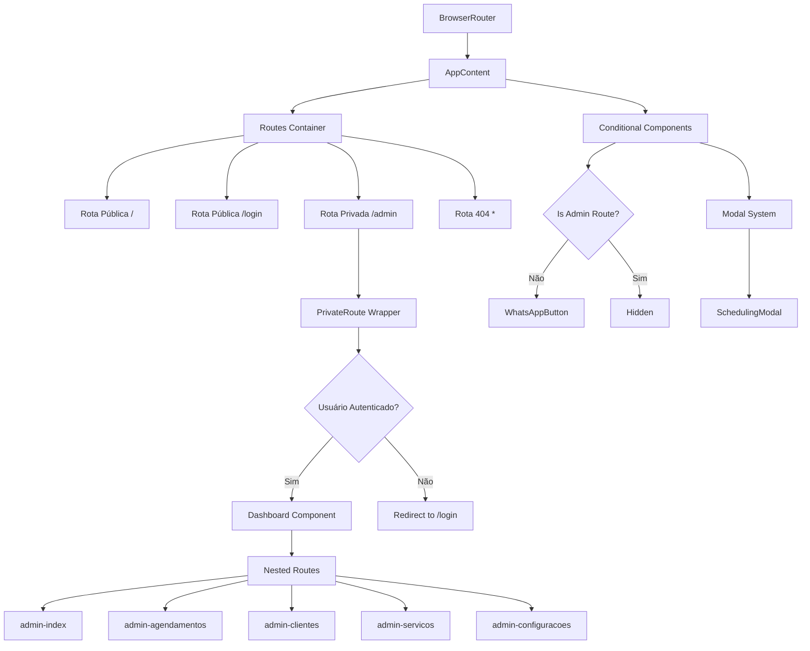
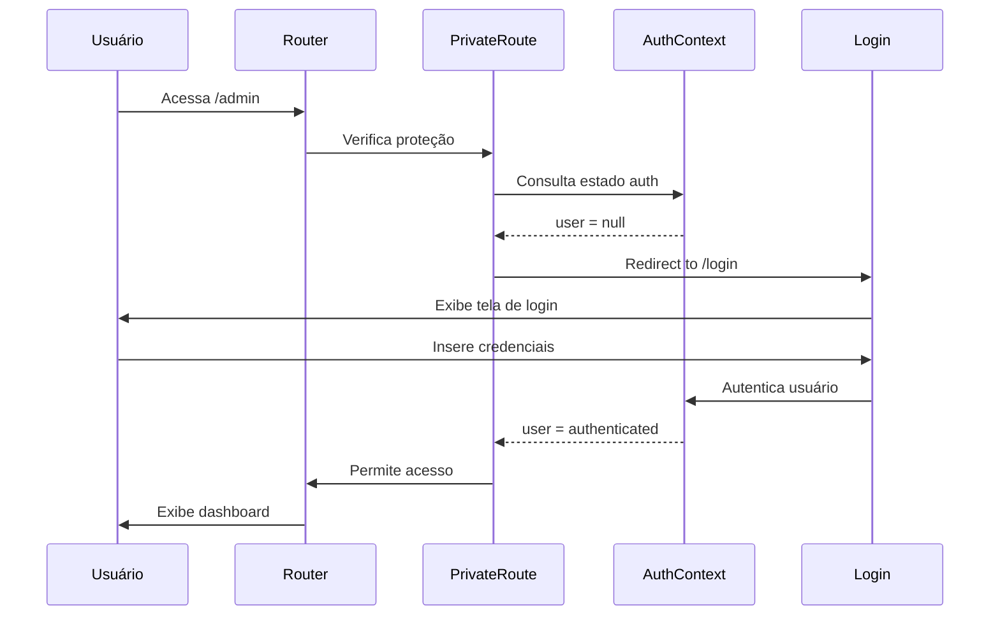

# Sistema de Rotas - ColdTech

## 📋 Visão Geral

O sistema de rotas do ColdTech utiliza **React Router DOM v6** para gerenciar a navegação entre páginas, implementando rotas públicas e privadas com proteção de acesso baseada em autenticação.

## 🗺️ Mapa de Rotas

### Rotas Públicas
- `/` - Página inicial (HomePage)
- `/login` - Página de autenticação
- `*` - Página 404 (NotFoundPage)

### Rotas Privadas (Protegidas)
- `/admin` - Dashboard principal
- `/admin/agendamentos` - Gerenciar agendamentos
- `/admin/clientes` - Gerenciar clientes
- `/admin/servicos` - Gerenciar serviços
- `/admin/configuracoes` - Configurações do sistema

## 🏗️ Arquitetura do Sistema de Rotas



## 📁 Estrutura de Arquivos

```
src/routes/
├── index.jsx           # Configuração principal das rotas
├── PrivateRoute.jsx    # Componente de proteção de rotas
└── README.md          # Documentação das rotas
```

## 🔐 Sistema de Proteção de Rotas

### PrivateRoute Component

```javascript
const PrivateRoute = ({ children }) => {
  const { user, loading } = useContext(AuthContext);
  
  // Estado de carregamento
  if (loading) {
    return <LoadingScreen />;
  }
  
  // Verificação de autenticação
  if (!user) {
    return <Navigate to="/login" replace />;
  }
  
  // Renderizar conteúdo protegido
  return children;
};
```

### Fluxo de Autenticação



## 🧭 Configuração das Rotas

### Rota Principal (AppRoutes)

```javascript
export default function AppRoutes() {
  return (
    <BrowserRouter>
      <AppContent />
    </BrowserRouter>
  );
}
```

### Container de Conteúdo (AppContent)

```javascript
function AppContent() {
  const location = useLocation();
  const [isModalOpen, setIsModalOpen] = useState(false);
  const isAdminRoute = location.pathname.startsWith('/admin');

  return (
    <>
      <Routes>
        {/* Rotas definidas aqui */}
      </Routes>
      {!isAdminRoute && <WhatsAppButton />}
      {isModalOpen && <SchedulingModal />}
    </>
  );
}
```

## 🔄 Rotas Aninhadas (Nested Routes)

### Estrutura Hierárquica

```mermaid
graph LR
    A[/admin] --> B[Dashboard Layout]
    B --> C[index - DashboardHome]
    B --> D[agendamentos - AgendamentosAdmin]
    B --> E[clientes - ClientesAdmin]
    B --> F[servicos - ServicosAdmin]
    B --> G[configuracoes - Configurações]
```

### Implementação

```javascript
<Route path="/admin" element={
  <PrivateRoute>
    <Dashboard />
  </PrivateRoute>
}>
  <Route index element={<DashboardHome />} />
  <Route path="agendamentos" element={<AgendamentosAdmin />} />
  <Route path="clientes" element={<ClientesAdmin />} />
  <Route path="servicos" element={<ServicosAdmin />} />
  <Route path="configuracoes" element={<ConfiguracoesComponent />} />
</Route>
```

## 🎯 Navegação Condicional

### WhatsApp Button
- **Exibido:** Rotas públicas (`/`, `/login`, `404`)
- **Oculto:** Rotas administrativas (`/admin/*`)

```javascript
const isAdminRoute = location.pathname.startsWith('/admin');
{!isAdminRoute && <WhatsAppButton />}
```

### Modal System
- **SchedulingModal:** Controlado globalmente
- **Acessível:** De qualquer rota pública
- **Estado:** Gerenciado no AppContent

## 📱 Navegação Responsiva

### Menu Principal (Navbar)
```javascript
const isHomePage = location.pathname === '/';

{isHomePage ? (
  // Links para seções da página inicial
  <>
    <a href="#servicos">Serviços</a>
    <a href="#cta">Contato</a>
    <Link to="/login">Área Restrita</Link>
  </>
) : (
  // Links para navegação geral
  <>
    <a onClick={() => navigateToSection('#servicos')}>Serviços</a>
    <a onClick={() => navigateToSection('#cta')}>Contato</a>
  </>
)}
```

## 🔍 Tratamento de Erros

### Página 404
- **Rota:** `*` (catch-all)
- **Componente:** `NotFoundPage`
- **Funcionalidades:**
  - Botão voltar ao início
  - Links para seções principais
  - Botão de agendamento
  - Design responsivo

### Redirecionamentos
```javascript
// Usuário não autenticado tentando acessar /admin
<Navigate to="/login" replace />

// Usuário autenticado acessando /login
useEffect(() => {
  if (user) {
    navigate('/admin');
  }
}, [user, navigate]);
```

## 🚦 Estados de Carregamento

### Loading Screen
```javascript
if (loading) {
  return (
    <div className="loading-screen">
      <p>Carregando...</p>
    </div>
  );
}
```

### Lazy Loading (Futuro)
```javascript
const Dashboard = lazy(() => import('../pages/Admin/Dashboard'));
const HomePage = lazy(() => import('../components/HomePage'));

<Suspense fallback={<LoadingSpinner />}>
  <Routes>
    {/* Rotas aqui */}
  </Routes>
</Suspense>
```

## 📊 Monitoramento de Rotas

### Analytics (Futuro)
```javascript
// Hook para tracking de páginas
useEffect(() => {
  analytics.track('page_view', {
    path: location.pathname,
    timestamp: new Date()
  });
}, [location]);
```

### Breadcrumbs
```javascript
const getBreadcrumbs = (pathname) => {
  const paths = pathname.split('/').filter(Boolean);
  return paths.map((path, index) => ({
    name: path.charAt(0).toUpperCase() + path.slice(1),
    path: '/' + paths.slice(0, index + 1).join('/')
  }));
};
```

## 🔧 Configurações Avançadas

### Route Guards
```javascript
const RouteGuard = ({ children, requiredRole }) => {
  const { user } = useContext(AuthContext);
  
  if (!user || !user.roles.includes(requiredRole)) {
    return <Navigate to="/unauthorized" />;
  }
  
  return children;
};
```

### Dynamic Routes (Futuro)
```javascript
<Route path="/admin/cliente/:id" element={<ClienteDetalhes />} />
<Route path="/admin/agendamento/:id" element={<AgendamentoDetalhes />} />
```

## 🎨 Transições de Página

### Animações (Futuro)
```javascript
import { AnimatePresence, motion } from 'framer-motion';

<AnimatePresence mode="wait">
  <motion.div
    key={location.pathname}
    initial={{ opacity: 0, x: 20 }}
    animate={{ opacity: 1, x: 0 }}
    exit={{ opacity: 0, x: -20 }}
    transition={{ duration: 0.3 }}
  >
    <Routes location={location}>
      {/* Rotas aqui */}
    </Routes>
  </motion.div>
</AnimatePresence>
```

## 📈 Performance

### Code Splitting
- **Implementação futura** com React.lazy()
- **Chunks separados** por rota
- **Loading otimizado** para cada seção

### Preloading
```javascript
// Precarregar rotas críticas
const preloadRoute = (routeComponent) => {
  const componentImport = routeComponent();
  return componentImport;
};
```

## 🛠️ Debugging

### Route Debugging
```javascript
// Hook para debug de rotas
const useRouteDebug = () => {
  const location = useLocation();
  
  useEffect(() => {
    console.log('Route changed:', {
      pathname: location.pathname,
      search: location.search,
      hash: location.hash,
      state: location.state
    });
  }, [location]);
};
```

---

**ColdTech** - Sistema de Rotas Robusto e Escalável
*Versão 1.0 - React Router DOM v6*
