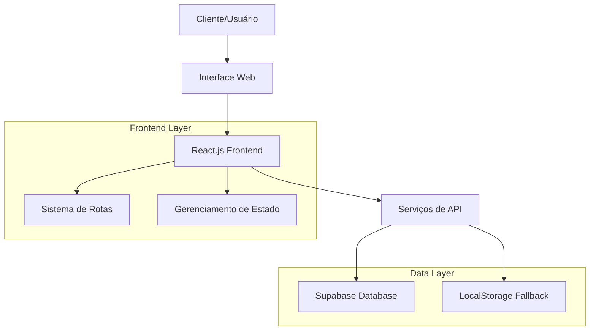
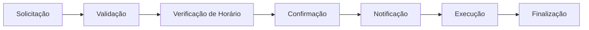

# Escopo do Projeto - ColdTech

## 📋 Visão Geral

O **ColdTech** é um sistema web completo para gerenciamento de serviços de ar-condicionado, desenvolvido em React.js com foco na eficiência operacional e experiência do usuário.

> **Em termos simples:** É uma plataforma digital que ajuda empresas de ar-condicionado a gerenciar seus agendamentos, clientes e serviços de forma organizada e eficiente.

## 🎯 Objetivos do Projeto

### Objetivo Principal
Criar uma plataforma digital que centralize e automatize os processos de agendamento, gerenciamento de clientes e controle de serviços de manutenção de ar-condicionado.

### Objetivos Específicos
- **Automatizar agendamentos** de serviços técnicos
- **Centralizar informações** de clientes e histórico
- **Otimizar gestão** de equipe e recursos
- **Melhorar comunicação** com clientes
- **Gerar relatórios** e estatísticas operacionais

## 🏗️ Arquitetura do Sistema

> **Explicação do diagrama:** Este diagrama mostra como o sistema funciona. Os usuários interagem com a interface web, que é construída com React.js. O sistema gerencia a navegação entre páginas (rotas), mantém o estado da aplicação e se comunica com o banco de dados Supabase. Se a conexão com o banco falhar, o sistema usa o armazenamento local do navegador como backup.

## 👥 Quem Vai Utilizar o Sistema

### Usuários Primários
- **Administradores:** Gestores da empresa ColdTech que precisam de visão completa do negócio
- **Técnicos:** Profissionais que executam os serviços e precisam acessar informações de agendamentos
- **Clientes:** Pessoas que solicitam serviços de ar-condicionado

### Usuários Secundários
- **Atendentes:** Equipe de suporte ao cliente que agenda serviços por telefone
- **Gerentes:** Supervisores que monitoram o desempenho da equipe

## 🔧 Funcionalidades Principais

### 1. **Área Pública**
- **Landing Page** com informações da empresa
- **Formulário de Agendamento** para clientes solicitarem serviços
- **Seção de Serviços** oferecidos com descrições e benefícios
- **Informações de Contato** para comunicação direta
- **Botão WhatsApp** para comunicação rápida

> **Valor para o negócio:** Estas funcionalidades permitem que clientes conheçam os serviços e façam agendamentos 24 horas por dia, sem necessidade de atendimento telefônico.

### 2. **Área Administrativa**
- **Dashboard** com métricas e estatísticas importantes
- **Gerenciamento de Agendamentos**
  - Visualizar, criar, editar e excluir compromissos
  - Filtros por status e data para organização
  - Controle de horários disponíveis para evitar conflitos
- **Gestão de Clientes**
  - Cadastro completo e histórico de serviços
  - Informações de contato e endereço para visitas
- **Controle de Serviços**
  - Tipos de serviço oferecidos pela empresa
  - Preços e descrições detalhadas

> **Valor para o negócio:** A área administrativa centraliza todas as informações necessárias para a operação eficiente da empresa, reduzindo erros e aumentando a produtividade.

### 3. **Sistema de Autenticação**
- **Login seguro** para área administrativa
- **Controle de sessão** com localStorage
- **Proteção de rotas** privadas

> **Valor para o negócio:** Garante que apenas pessoas autorizadas tenham acesso às informações sensíveis da empresa e dos clientes.

## 📊 Módulos do Sistema

### Módulo de Agendamentos

> **Explicação do diagrama:** Este fluxo mostra como funciona o processo de agendamento, desde a solicitação inicial até a finalização do serviço. Cada etapa é gerenciada pelo sistema para garantir que não haja conflitos de horário e que todas as partes sejam notificadas adequadamente.

### Módulo de Clientes
- **Cadastro:** Nome, contato, endereço
- **Histórico:** Serviços realizados anteriormente
- **Status:** Ativo/Inativo para segmentação

### Módulo de Serviços
- **Tipos:** Instalação, manutenção preventiva, reparo
- **Preços:** Valores personalizáveis por serviço
- **Descrições:** Detalhes técnicos e duração estimada

## 🛠️ Tecnologias Utilizadas

### Frontend
- **React.js 18+** - Framework principal para construção da interface
- **React Router DOM** - Gerenciamento de navegação e rotas
- **CSS3** - Estilização responsiva para todos os dispositivos
- **JavaScript ES6+** - Linguagem de programação para lógica de negócio

### Backend/Database
- **Supabase** - Plataforma de banco de dados PostgreSQL com API integrada
- **LocalStorage** - Armazenamento local para funcionamento offline

> **Por que estas tecnologias?** React.js oferece excelente performance e facilidade de manutenção. Supabase proporciona um banco de dados robusto com API pronta para uso, reduzindo o tempo de desenvolvimento.

## 📱 Responsividade

### Dispositivos Suportados
- **Desktop:** 1200px+
- **Tablet:** 768px - 1199px
- **Mobile:** 320px - 767px

### Características Responsivas
- Layout flexível com CSS Grid/Flexbox
- Imagens otimizadas para diferentes tamanhos de tela
- Menu mobile com hamburger para navegação compacta
- Formulários adaptáveis a qualquer dispositivo

> **Benefício:** O design responsivo garante que o sistema possa ser utilizado em qualquer dispositivo, permitindo que técnicos acessem informações em campo através de smartphones.

## 🔒 Segurança

### Medidas Implementadas
- **Autenticação** com credenciais seguras
- **Proteção de rotas** administrativas contra acesso não autorizado
- **Validação** de dados de entrada para prevenir erros
- **Sanitização** de inputs do usuário para evitar ataques

### Melhorias Futuras
- Hash bcrypt para senhas
- JWT tokens para gerenciamento de sessões
- Rate limiting para proteção contra ataques de força bruta
- Auditoria de ações para rastreabilidade

## 📈 Métricas e KPIs

### Indicadores de Performance
- **Total de Agendamentos** por período
- **Taxa de Conversão** de solicitações em serviços realizados
- **Tempo Médio** de resposta a solicitações
- **Satisfação do Cliente** (implementação futura)

### Relatórios Disponíveis
- Agendamentos por status (pendentes, concluídos, cancelados)
- Faturamento mensal e projeções
- Clientes mais ativos e recorrentes
- Serviços mais solicitados e lucrativos

> **Valor para gestão:** Estes indicadores permitem que os gestores tomem decisões baseadas em dados concretos, identificando tendências e oportunidades de melhoria.

## 🚀 Roadmap de Desenvolvimento

### Fase 1 - MVP (Produto Mínimo Viável) ✅
- [x] Interface básica e responsiva
- [x] Sistema de agendamentos funcional
- [x] Autenticação simples para área administrativa
- [x] CRUD básico para todas as entidades

### Fase 2 - Melhorias 🔄
- [ ] Notificações por email/SMS para confirmações
- [ ] Relatórios avançados e exportáveis
- [ ] App mobile para técnicos em campo
- [ ] Integração com calendário Google/Outlook

### Fase 3 - Expansão 📋
- [ ] Multi-tenancy para atender múltiplas empresas
- [ ] API pública para integrações externas
- [ ] Integrações com sistemas de contabilidade
- [ ] IA para otimização de rotas e agendamentos

> **Estratégia:** Este roadmap permite entregar valor rapidamente com o MVP, enquanto planeja melhorias incrementais baseadas no feedback dos usuários.

## 💰 Benefícios Esperados

### Operacionais
- **Redução de 60%** no tempo dedicado a agendamentos
- **Eliminação de 90%** dos agendamentos duplicados ou conflitantes
- **Melhoria de 40%** na organização da agenda de técnicos

### Financeiros
- **Aumento de 25%** na eficiência operacional geral
- **Redução de 30%** em custos administrativos
- **Crescimento de 20%** na base de clientes ativos

### Estratégicos
- **Digitalização** completa dos processos operacionais
- **Melhoria** significativa na experiência do cliente
- **Escalabilidade** para suportar crescimento futuro

> **Retorno sobre investimento:** Estas melhorias se traduzem em economia de recursos, aumento de produtividade e maior satisfação do cliente, gerando retorno sobre o investimento no sistema.

## 📞 Suporte e Manutenção

### Níveis de Suporte
- **Nível 1:** Suporte básico ao usuário para questões simples
- **Nível 2:** Resolução de problemas técnicos mais complexos
- **Nível 3:** Desenvolvimento e implementação de melhorias

### Cronograma de Manutenção
- **Diário:** Backup automático de dados
- **Semanal:** Monitoramento de performance e uso
- **Mensal:** Atualizações de segurança e correções
- **Trimestral:** Implementação de novas funcionalidades

---

**ColdTech** - Transformando a gestão de serviços de ar-condicionado através da tecnologia
*Versão 1.0 - Sistema de Gerenciamento Completo*
