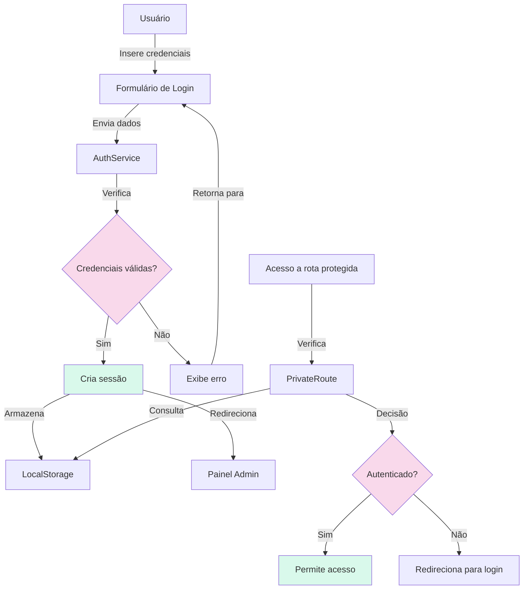
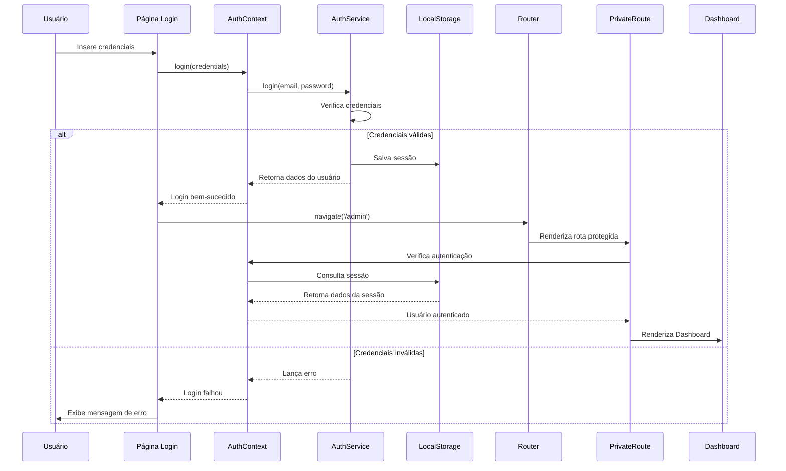

# Sistema de Login - ColdTech

## 📋 Visão Geral

O sistema ColdTech possui um painel administrativo protegido por autenticação, permitindo que apenas usuários autorizados acessem as funcionalidades de gerenciamento de agendamentos, clientes e serviços.

> **Em termos simples:** O sistema de login funciona como uma porta trancada que só pode ser aberta com as credenciais corretas, garantindo que apenas pessoas autorizadas possam acessar informações sensíveis e ferramentas administrativas.

## 🔐 Arquitetura de Autenticação



> **Explicação do diagrama:** Este fluxograma mostra o processo completo de autenticação. Quando um usuário tenta fazer login, suas credenciais são verificadas. Se forem válidas, uma sessão é criada e armazenada no localStorage do navegador. Quando o usuário tenta acessar uma rota protegida, o componente PrivateRoute verifica se existe uma sessão válida antes de permitir o acesso.

## 🔑 Credenciais de Acesso

### Credenciais Temporárias (Desenvolvimento)
- **Email:** `admin@coldtech.com`
- **Senha:** `admin123`

> **Importante:** Estas são credenciais temporárias para desenvolvimento. Em produção, devem ser substituídas por credenciais seguras armazenadas no banco de dados.

## 🚪 Processo de Login

### 1. Formulário de Login
```javascript
function Login() {
  const [credentials, setCredentials] = useState({ email: '', password: '' });
  const [error, setError] = useState('');
  const { login } = useContext(AuthContext);
  const navigate = useNavigate();

  const handleSubmit = async (e) => {
    e.preventDefault();
    setError('');
    
    try {
      // Validação básica
      if (!credentials.email || !credentials.password) {
        setError('Por favor, preencha todos os campos');
        return;
      }
      
      const success = await login(credentials);
      if (success) {
        navigate('/admin');
      } else {
        setError('Usuário ou senha inválidos');
      }
    } catch (err) {
      setError('Erro ao fazer login: ' + err.message);
    }
  };
}
```

> **O que este código faz:** Cria um formulário de login que captura email e senha, realiza validação básica e tenta autenticar o usuário através do AuthContext. Se bem-sucedido, redireciona para o painel administrativo; caso contrário, exibe uma mensagem de erro.

### 2. Serviço de Autenticação
```javascript
class SimpleAuthService {
  async login(email, senha) {
    try {
      // Solução temporária: permitir login com credenciais fixas
      if (email === 'admin@coldtech.com' && senha === 'admin123') {
        // Criar usuário temporário
        const tempUser = {
          id: 1,
          email: 'admin@coldtech.com',
          nome: 'Administrador'
        };
        
        // Salvar informações do usuário no localStorage
        localStorage.setItem('coldtech_user', JSON.stringify({
          ...tempUser,
          isAuthenticated: true
        }));
        
        return tempUser;
      }
      
      // Código para autenticação com banco de dados
      const { data: usuario, error } = await supabase
        .from('usuarios')
        .select('*')
        .eq('email', email)
        .single();
      
      if (error || !usuario) throw new Error('Usuário não encontrado');
      
      // Verificar senha
      const senhaCorreta = usuario.senha === senha;
      if (!senhaCorreta) throw new Error('Senha incorreta');
      
      // Salvar sessão
      localStorage.setItem('coldtech_user', JSON.stringify({
        id: usuario.id,
        email: usuario.email,
        nome: usuario.nome,
        isAuthenticated: true
      }));
      
      return usuario;
    } catch (error) {
      console.error('Erro no login:', error);
      throw error;
    }
  }
}
```

> **O que este código faz:** Implementa a lógica de autenticação, verificando as credenciais contra valores fixos (temporariamente) ou contra o banco de dados. Se as credenciais forem válidas, cria uma sessão armazenando os dados do usuário no localStorage.

## 🔒 Segurança de Senhas

### Sistema de Hash (Preparado para Produção)
```javascript
// utils/hashPassword.js
export async function hashPassword(password) {
  // Em produção, usar biblioteca como bcryptjs
  return `hashed_${password}`;
}

export async function comparePassword(password, hashedPassword) {
  // Comparação segura de senhas
  return `hashed_${password}` === hashedPassword;
}
```

> **Como funciona o hash:** Em vez de armazenar senhas em texto puro, o sistema converte a senha em um código irreversível (hash). Quando o usuário tenta fazer login, a senha fornecida passa pelo mesmo processo de hash e o resultado é comparado com o hash armazenado. Isso protege as senhas mesmo se o banco de dados for comprometido.

### Implementação Futura com Bcrypt
```javascript
import bcrypt from 'bcryptjs';

export async function hashPassword(password) {
  const salt = await bcrypt.genSalt(10);
  return bcrypt.hash(password, salt);
}

export async function comparePassword(password, hashedPassword) {
  return bcrypt.compare(password, hashedPassword);
}
```

> **Por que usar bcrypt:** O bcrypt é uma função de hash projetada especificamente para senhas, incluindo um "salt" aleatório e sendo deliberadamente lenta para dificultar ataques de força bruta.

## 💾 Gerenciamento de Sessão

### Armazenamento no LocalStorage
```javascript
// Armazenamento da sessão
localStorage.setItem('coldtech_user', JSON.stringify({
  id: usuario.id,
  email: usuario.email,
  nome: usuario.nome,
  isAuthenticated: true
}));
```

> **O que é localStorage:** É uma API do navegador que permite armazenar dados no computador do usuário de forma persistente (os dados permanecem mesmo após fechar o navegador). É usado para manter a sessão do usuário entre visitas ao site.

### Verificação de Autenticação
```javascript
isAuthenticated() {
  const user = localStorage.getItem('coldtech_user');
  if (!user) return false;
  
  try {
    const userData = JSON.parse(user);
    return userData.isAuthenticated === true;
  } catch {
    return false;
  }
}
```

> **O que este código faz:** Verifica se existe uma sessão válida armazenada no localStorage. Se existir e o campo `isAuthenticated` for verdadeiro, considera o usuário como autenticado.

### Logout
```javascript
logout() {
  localStorage.removeItem('coldtech_user');
  localStorage.removeItem('user');
  sessionStorage.clear();
}
```

> **O que este código faz:** Encerra a sessão do usuário removendo todos os dados de autenticação do armazenamento local e da sessão.

## 🛡️ Proteção de Rotas

### Componente PrivateRoute
```javascript
const PrivateRoute = ({ children }) => {
  const { user, loading } = useContext(AuthContext);
  
  // Mostrar indicador de carregamento enquanto verifica
  if (loading) {
    return <LoadingScreen />;
  }
  
  // Redirecionar se não estiver autenticado
  if (!user) {
    return <Navigate to="/login" replace />;
  }
  
  // Renderizar conteúdo protegido
  return children;
};
```

> **Como funciona:** Este componente envolve rotas que requerem autenticação. Antes de renderizar o conteúdo, verifica se o usuário está autenticado. Se não estiver, redireciona para a página de login.

### Uso nas Rotas
```javascript
<Route path="/admin" element={
  <PrivateRoute>
    <Dashboard />
  </PrivateRoute>
}>
  <Route index element={<DashboardHome />} />
  <Route path="agendamentos" element={<AgendamentosAdmin />} />
  {/* Outras rotas protegidas */}
</Route>
```

> **Benefício desta abordagem:** Centraliza a lógica de proteção, evitando duplicação de código e garantindo que todas as rotas administrativas sejam consistentemente protegidas.

## 🔄 Contexto de Autenticação

### AuthContext
```javascript
const AuthContext = createContext();

export function AuthProvider({ children }) {
  const [user, setUser] = useState(null);
  const [loading, setLoading] = useState(true);
  
  useEffect(() => {
    // Verificar se já existe uma sessão
    const checkAuth = () => {
      const userData = authService.getCurrentUser();
      setUser(userData);
      setLoading(false);
    };
    
    checkAuth();
  }, []);
  
  const login = async (credentials) => {
    try {
      const user = await authService.login(credentials.email, credentials.password);
      setUser(user);
      return true;
    } catch (error) {
      return false;
    }
  };
  
  const logout = () => {
    authService.logout();
    setUser(null);
  };
  
  return (
    <AuthContext.Provider value={{ user, loading, login, logout }}>
      {children}
    </AuthContext.Provider>
  );
}
```

> **O que é Context API:** É um recurso do React que permite compartilhar dados entre componentes sem passar props manualmente em cada nível. No caso da autenticação, permite que qualquer componente acesse o estado de autenticação e funções relacionadas.

## 🔍 Fluxo Completo de Autenticação



> **Explicação do diagrama:** Este diagrama de sequência mostra a interação entre todos os componentes envolvidos no processo de autenticação, desde o momento em que o usuário insere suas credenciais até a renderização do Dashboard após autenticação bem-sucedida.

## 🔐 Melhorias de Segurança Recomendadas

### 1. Hash Bcrypt
Implementar bcryptjs para hash seguro de senhas com salt único para cada usuário.

### 2. JWT Tokens
```javascript
// Gerar token JWT
const token = jwt.sign(
  { id: user.id, email: user.email },
  process.env.JWT_SECRET,
  { expiresIn: '24h' }
);

// Verificar token
const decoded = jwt.verify(token, process.env.JWT_SECRET);
```

> **Vantagem dos JWT:** Tokens JWT (JSON Web Tokens) são assinados digitalmente, o que impede sua manipulação. Também podem conter informações sobre o usuário e expiração, melhorando a segurança da sessão.

### 3. Refresh Tokens
```javascript
// Emitir refresh token
const refreshToken = crypto.randomBytes(40).toString('hex');
await db.refreshTokens.insert({
  token: refreshToken,
  userId: user.id,
  expiresAt: new Date(Date.now() + 7 * 24 * 60 * 60 * 1000) // 7 dias
});

// Usar refresh token para obter novo access token
const newAccessToken = jwt.sign(
  { id: user.id, email: user.email },
  process.env.JWT_SECRET,
  { expiresIn: '1h' }
);
```

> **Como funcionam refresh tokens:** Permitem que o usuário permaneça logado por períodos mais longos sem comprometer a segurança. O access token tem vida curta (ex: 1 hora), enquanto o refresh token dura mais (ex: 7 dias) e pode ser usado para obter novos access tokens sem exigir novo login.

### 4. Rate Limiting
```javascript
const loginAttempts = {};

function checkRateLimit(email) {
  const now = Date.now();
  const windowSize = 15 * 60 * 1000; // 15 minutos
  const maxAttempts = 5;
  
  if (!loginAttempts[email]) {
    loginAttempts[email] = [];
  }
  
  // Limpar tentativas antigas
  loginAttempts[email] = loginAttempts[email].filter(
    attempt => now - attempt < windowSize
  );
  
  // Verificar número de tentativas
  if (loginAttempts[email].length >= maxAttempts) {
    return false; // Bloqueado
  }
  
  // Registrar nova tentativa
  loginAttempts[email].push(now);
  return true; // Permitido
}
```

> **Por que implementar rate limiting:** Limita o número de tentativas de login em um determinado período, protegendo contra ataques de força bruta que tentam adivinhar senhas.

## 📱 Interface de Login

### Design Responsivo
- **Layout adaptável** para desktop, tablet e mobile
- **Feedback visual** para estados de erro e carregamento
- **Validação em tempo real** dos campos de entrada
- **Mensagens de erro** claras e específicas

### Acessibilidade
- **Labels semânticos** para campos de formulário
- **Mensagens de erro** anunciadas por leitores de tela
- **Navegação por teclado** completa
- **Contraste adequado** para texto e elementos interativos

## 🔧 Considerações Técnicas

### Armazenamento Seguro
- **Senhas:** Nunca armazenadas em texto puro
- **Tokens:** Armazenados em localStorage para persistência
- **Dados sensíveis:** Nunca expostos no frontend

### Expiração de Sessão
- **Timeout de inatividade:** Logout automático após período sem atividade
- **Expiração forçada:** Tokens com tempo de vida limitado
- **Renovação transparente:** Refresh tokens para manter sessão válida

---

**ColdTech** - Sistema de Autenticação Seguro e Eficiente
*Versão 1.0 - Implementação com React Context e LocalStorage*
